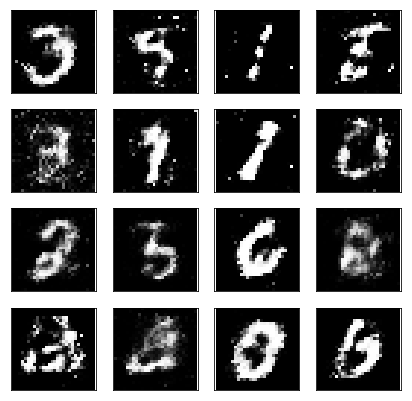

# Generative Adversarial Networks (GAN)

## Introduction

Build a generative adversarial network (GAN) trained on the MNIST dataset. From this, we'll be able to generate new handwritten digits.

GANs were [first reported on](https://arxiv.org/abs/1406.2661) in 2014 from Ian Goodfellow and others in Yoshua Bengio's lab. Since then, GANs have exploded in popularity. Here are a few examples to check out:

* [Pix2Pix](https://affinelayer.com/pixsrv/) 
* [CycleGAN](https://github.com/junyanz/CycleGAN)
* [A whole list](https://github.com/wiseodd/generative-models)

The idea behind GANs is that you have two networks, a generator $G$ and a discriminator $D$, competing against each other. The generator makes fake data to pass to the discriminator. The discriminator also sees real data and predicts if the data it's received is real or fake. The generator is trained to fool the discriminator, it wants to output data that looks _as close as possible_ to real data. And the discriminator is trained to figure out which data is real and which is fake. What ends up happening is that the generator learns to make data that is indistiguishable from real data to the discriminator.

The general structure of a GAN is shown in the diagram above, using MNIST images as data. The latent sample is a random vector the generator uses to contruct its fake images. As the generator learns through training, it figures out how to map these random vectors to recognizable images that can fool the discriminator.

The output of the discriminator is a sigmoid function, where 0 indicates a fake image and 1 indicates an real image. 

* `Intro_to_GANs.ipynb`

Sample generated figures:

## Autoencoders

Build a simple autoencoder to compress the MNIST dataset. With autoencoders, we pass input data through an encoder that makes a compressed representation of the input. Then, this representation is passed through a decoder to reconstruct the input data. Generally the encoder and decoder will be built with neural networks, then trained on example data.

* `Simple_Autoencoder.ipynb`
* `Convolutional_Autoencoder.ipynb`
* `demo_generate_images.ipynb`

## Deep Convolutional GANs

Implement the Deep Convolutional GAN model to generate full color images. The additional complexity of these images requires using convolutional layers in the generator and discriminator. Batch normalization is also needed to get the GAN to train appropriately.

* `Batch_Normalization.ipynb`
* `DCGAN.ipynb`

## Generate Faces

Use a generative adversarial network (GAN) to generate novel faces.

* `face_generation.ipynb`

## Semi-supervised Learning

In supervised learning, we have a training set of inputs $x$ and class labels $y$. We train a model that takes $x$ as input and gives $y$ as output.

In semi-supervised learning, our goal is still to train a model that takes $x$ as input and generates $y$ as output. However, not all of our training examples have a label $y$. We need to develop an algorithm that is able to get better at classification by studying both labeled $(x, y)$ pairs and unlabeled $x$ examples.

To do this for the SVHN dataset, we'll turn the GAN discriminator into an 11 class discriminator. It will recognize the 10 different classes of real SVHN digits, as well as an 11th class of fake images that come from the generator. The discriminator will get to train on real labeled images, real unlabeled images, and fake images. By drawing on three sources of data instead of just one, it will generalize to the test set much better than a traditional classifier trained on only one source of data.

* `semi-supervised_learning.ipynb`

## [how_to_generate_video](https://github.com/llSourcell/how_to_generate_video)

This is the code for "How to Generate Video - Intro to Deep Learning #15' by Siraj Raval on YouTube

* `logograms.ipynb`

## Resources

* [Generative Models](https://blog.openai.com/generative-models/)
* Neural Information Processing Systems Conference - NIPS 2016: [Generative Adversarial Networks](https://channel9.msdn.com/Events/Neural-Information-Processing-Systems-Conference/Neural-Information-Processing-Systems-Conference-NIPS-2016/Generative-Adversarial-Networks)
* [An introduction to Generative Adversarial Networks (with code in TensorFlow)](http://blog.aylien.com/introduction-generative-adversarial-networks-code-tensorflow/)
* [Generative Adversarial Nets in TensorFlow](http://wiseodd.github.io/techblog/2016/09/17/gan-tensorflow/)
* [Improved Techniques for Training GANs](https://arxiv.org/pdf/1606.03498.pdf)
* [Semi-supervised Learning with Deep Generative Models](https://arxiv.org/pdf/1406.5298.pdf)
* [Improved Techniques for Training GANs](https://arxiv.org/pdf/1606.03498.pdf)
