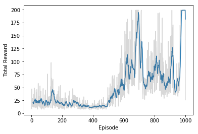

# Reinforcement Learning

Build a neural network that can learn to play games through reinforcement learning. More specifically, we'll use Q-learning to train an agent to play a game called [Cart-Pole](https://gym.openai.com/envs/CartPole-v0). In this game, a freely swinging pole is attached to a cart. The cart can move to the left and right, and the goal is to keep the pole upright as long as possible.

We can simulate this game using [OpenAI Gym](https://gym.openai.com/).

### Q-Network - `QNetwork`

### Experience replay

Reinforcement learning algorithms can have stability issues due to correlations between states. To reduce correlations when training, we can store the agent's experiences and later draw a random mini-batch of those experiences to train on.

### Q-Learning training algorithm

We'll train the network in _episodes_. One *episode* is one simulation of the game. For this game, the goal is to keep the pole upright for 195 frames. So we can start a new episode once meeting that goal. The game ends if the pole tilts over too far, or if the cart moves too far the left or right. When a game ends, we'll start a new episode:

* Initialize the memory $D$
* Initialize the action-value network $Q$ with random weights
* **For** episode = 1, $M$ **do**
  * **For** $t$, $T$ **do**
     * With probability $\epsilon$ select a random action $a_t$, otherwise select $a_t = \mathrm{argmax}_a Q(s,a)$
     * Execute action $a_t$ in simulator and observe reward $r_{t+1}$ and new state $s_{t+1}$
     * Store transition $<s_t, a_t, r_{t+1}, s_{t+1}>$ in memory $D$
     * Sample random mini-batch from $D$: $<s_j, a_j, r_j, s'_j>$
     * Set $\hat{Q}_j = r_j$ if the episode ends at $j+1$, otherwise set $\hat{Q}_j = r_j + \gamma \max_{a'}{Q(s'_j, a')}$
     * Make a gradient descent step with loss $(\hat{Q}_j - Q(s_j, a_j))^2$
  * **endfor**
* **endfor**

### Training and Visualization

## Extending this

So, Cart-Pole is a pretty simple game. However, the same model can be used to train an agent to play something much more complicated like Pong or Space Invaders. Instead of a state like we're using here though, we'd want to use convolutional layers to get the state from the screen images.

Here's the original paper: http://www.davidqiu.com:8888/research/nature14236.pdf.

## [Smartcab](https://github.com/udacity/machine-learning/tree/master/projects/smartcab)

Apply reinforcement learning techniques for a self-driving agent in a simplified world to aid it in effectively reaching its destinations in the allotted time. First, investigate the environment the agent operates in by constructing a very basic driving implementation. Once the agent is successful at operating within the environment, identify each possible state the agent can be in when considering such things as traffic lights and oncoming traffic at each intersection. With states identified, implement a Q-Learning algorithm for the self-driving agent to guide the agent towards its destination within the allotted time. Finally, improve upon the Q-Learning algorithm to find the best configuration of learning and exploration factors to ensure the self-driving agent is reaching its destinations with consistently positive results.

