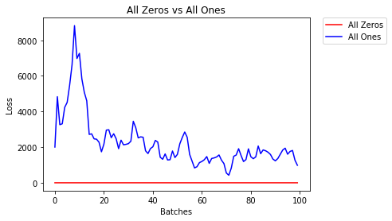
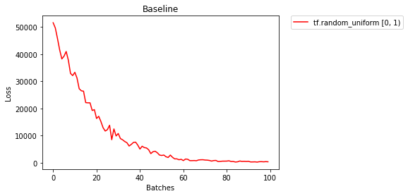
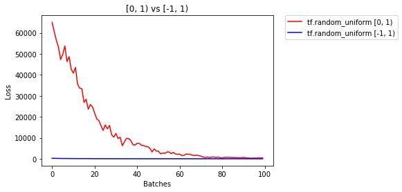
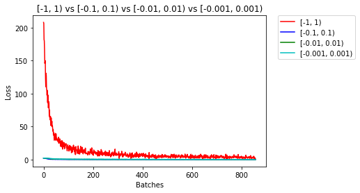
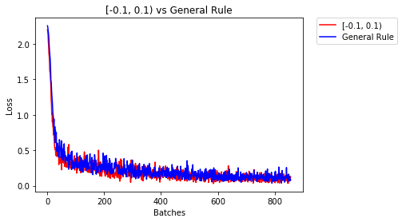
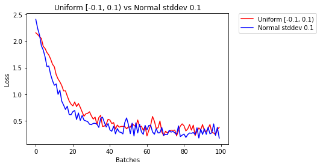
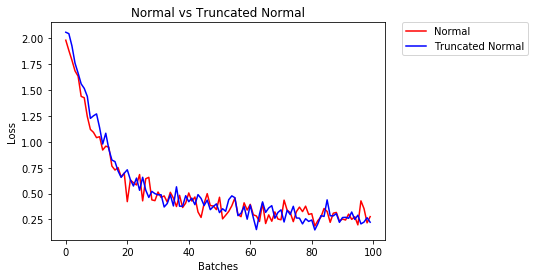

# Simple Neural Network

Build a simple neural network and use it to predict daily bike rental ridership. 

`Simple_Neural_Network.ipynb` - 

* Load and prepare the data
* Data exploration
* Build the network:
* Train the network
* Test

Having good initial weights can place the neural network close to the optimal solution. This allows the neural network to come to the best solution quicker. To see how different weights perform, we'll test on the same [dataset](https://en.wikipedia.org/wiki/MNIST_database) and neural network (below).

 

`Weight_Initialization_NN.ipynb` - 

* All zeros or ones

   
Validation Accuracy. 
   11.260% -- All Zeros. 
   10.020% -- All Ones. 
Loss. 
    2.304  -- All Zeros. 
  236.497  -- All Ones. 

* Uniform distribution

	- Baseline: minval=0.0 and maxval=1.0

 
Validation Accuracy. 
   48.220% -- tf.random_uniform [0, 1). 
Loss. 
   82.085  -- tf.random_uniform [0, 1). 

	- BaselinePlus: minval=-1.0 and maxval=1.0

 
Validation Accuracy. 
   82.900% -- tf.random_uniform [0, 1). 
   90.080% -- tf.random_uniform [-1, 1). 
Loss. 
    7.432  -- tf.random_uniform [0, 1). 
    3.851  -- tf.random_uniform [-1, 1). 

	- Compare [-0.1, 0.1), [-0.01, 0.01), and [-0.001, 0.001):

Validation Accuracy. 
   90.160% -- [-1, 1). 
   96.940% -- [-0.1, 0.1). 
   95.420% -- [-0.01, 0.01). 
   94.340% -- [-0.001, 0.001). 
Loss  
    1.008  -- [-1, 1). 
    0.182  -- [-0.1, 0.1). 
    0.126  -- [-0.01, 0.01). 
    0.284  -- [-0.001, 0.001). 

	- General rule for setting weights:

Validation Accuracy. 
   96.920% -- [-0.1, 0.1). 
   96.760% -- General Rule  
Loss. 
    0.124  -- [-0.1, 0.1). 
    0.081  -- General Rule. 

* Normal distribution

Validation Accuracy. 
   97.040% -- Uniform [-0.1, 0.1). 
   97.280% -- Normal stddev 0.1. 
Loss. 
    0.048  -- Uniform [-0.1, 0.1). 
    0.075  -- Normal stddev 0.1. 

* Truncated normal distribution

Validation Accuracy  
   96.940% -- Normal. 
   96.540% -- Truncated Normal. 
Loss. 
    0.124  -- Normal. 
    0.221  -- Truncated Normal. 
